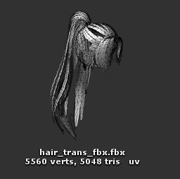
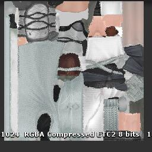
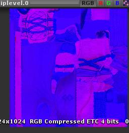

# 《一梦江湖》渲染分析
##前言
《一梦江湖》原名《楚留香》，在去IP化中渲染质量同时也进行了升级，为当前手游市场上同类型游戏渲染的代表作。本文从渲染管线，阴影，光照，GI，后处理等多个角度对本游戏PC和移动两个版本，结合Demo实例具体分析。（图为Demo还原角色）

## 准备
#### 解析工具
* GPA
* Snapdragon Profiler

PC版本使用GPA渲染分析工具截帧分析，移动平台为小米8手机（高通骁龙845），渲染分析工具为Snapdragon Profiler。

#### Demo 还原平台
* Unity 2018.3.5 

研究过程中对游戏角色主要材质着色器在Unity3D引擎进行还原，为了通用性，并未使用SRP，而采样默认渲染管线。

##渲染管线分析

《一梦江湖》PC渲染流程如上图，为前向渲染管线。移动端中不绘制AO。且移动平台线性空间转Gamma空间在Opaque,Mask，Transparent三个阶段中执行；而PC中G在Combine Bloom阶段。

在绘制Depth阶段，写入深度，同时角色单独写入模板。在Opaque和Mask阶段ZTest Func 为Equal.

Transparent 绘制前先把ColorRT拷贝出来，然后先绘制折射效果的如水面，角色眼睛角膜等对象，然后再绘制其余半透明渲染对象。

## 阴影和AO

《一梦江湖》Shadowmap渲染在3张1024的RT。其中角色Shadow每帧都更新，单独绘制在一张RT上，在光照阶段采样。场景Shadow近处和远处物体分别绘制，在ScreenSpaceShadow阶段分两个Pass采样计算SSShadow。

|Character Shadowmap|Scene Shadowmap 1| Scene Shadowmap2 |
|-|-|-|
||||

场景SSAO在场景ScreenSpaceShadow阶段之后绘制在降分辨率的一张纹理上，模糊之后写入场景ScreenSpaceShadow RT上另一个通道中。

|ScreenSpaceShadow| AO |Blend AO|
|-|-|-|
||||

## 角色渲染

《一梦江湖》角色分为 身体，头部，头发，眼球（左右），角膜和泪腺，眉毛，睫毛等几个部分。其中身体，头部，眼球为不透明渲染；头发前后分别是镂空渲染和半透明渲染；眉毛和睫毛为半透明渲染，角膜和泪腺为半透明折射渲染。
其模型三角面数如下：

|Name|Body|Head|Eye|Corneal|Eyebrows|Eyelash|Hair mask|Hair Transparent|
|-|-|-|-|-|-|-|-|
|**Mesh**|||||| | | |
|**Triangles**|7066|5396|312|406|312|972|1545|5048|

### Body

《一梦江湖》角色身体皮肤和衣服并未分开，用Mask贴图区分开来，采用统一的光照。纹理大小为2048。

|Name|Base Color|Normal|Mask|Mix|
|-|-|-|-|-|
|Texture|||||
|Size|1024|512|512|1024|

* Normal 纹理A通道存储SSSmask.用于区分皮肤和其他部分
* BaseColor RGB为漫反射颜色，A通道为Mask
* Mix 纹理 R通道为Smoothness，G通道为 Metallic，B 通道为AO
* Mask 存储mask值区分布料和其他
* 受到的光照影响有:Directional Light，摄像机方向的 Virtual Directional Light, Dynamic GI，环境光。

### Head

角色头部渲染采用Pre-intergrated Skin Shading

