# 《一梦江湖》渲染分析
##0x00 前言
《一梦江湖》原名《楚留香》，在去IP化中渲染质量同时也进行了升级，为当前手游市场上同类型游戏渲染的代表作。本文从渲染管线，阴影，光照，GI，后处理等多个角度对本游戏PC和移动两个版本，结合Demo实例具体分析。（图为Demo还原角色）

## 0x01 准备
#### 解析工具
* GPA
* Snapdragon Profiler

PC版本使用GPA渲染分析工具截帧分析，移动平台为小米8手机（高通骁龙845），渲染分析工具为Snapdragon Profiler。

#### Demo 还原平台
* Unity 2018.3.5 

研究过程中对游戏角色主要材质着色器在Unity3D引擎进行还原，为了通用性，并未使用SRP，而采样默认渲染管线。

##0x02 渲染管线分析

《一梦江湖》PC渲染流程如上图，为前向渲染管线。移动端中不绘制AO。且移动平台线性空间转Gamma空间在Opaque,Mask，Transparent三个阶段中执行；而PC中颜色矫正在Combine Bloom阶段。

在绘制Depth阶段，写入深度，同时角色单独写入模板。在Opaque阶段ZTest Func 为Equal.

Transparent 绘制前先把ColorRT拷贝出来，然后先绘制折射效果的如水面，角色眼睛角膜等对象，然后再绘制其余半透明渲染对象。

## 0x03 阴影和AO

《一梦江湖》Shadowmap渲染在3张1024的RT。其中角色Shadow每帧都更新，单独绘制在一张RT上，在光照阶段采样。场景Shadow近处和远处物体分别绘制，在ScreenSpaceShadow阶段分两个Pass采样计算SSShadow。

|Character Shadowmap|Scene Shadowmap 1| Scene Shadowmap2 |
|-|-|-|
|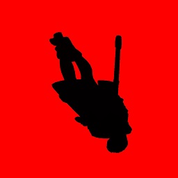|||

场景SSAO在场景ScreenSpaceShadow阶段之后绘制在降分辨率的一张纹理上，模糊之后写入场景ScreenSpaceShadow RT上另一个通道中。

|ScreenSpaceShadow| AO |Blend AO|
|-|-|-|
||||

## 0x04 光照
《一梦江湖》场景和角色受光照不同，主要差别在场景受烘焙GI影响，角色额外受动态GI和一个摄像机方向的虚拟光影响。

###1. 场景光照分析

场景光照主要由以下几部分构成：
 * Directional light(Sun)
 * Bake GI
 * 环境光反射(IBL)

|Lighting |Sun Diffuse|Sun Specular|Bake GI Diffuse|Env Specular|
|-|-|-|-|-|
||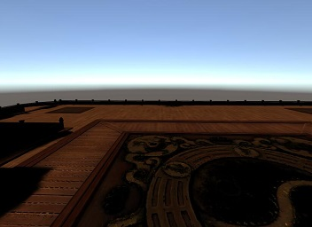|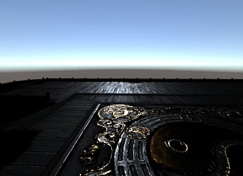||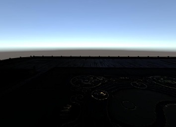|

**Directional Light**

  Lambert漫反射光照模型，GGX BRDF高光模型

**环境光反射**

  环境光压缩在一张256 * 256 的纹理上，如图：

  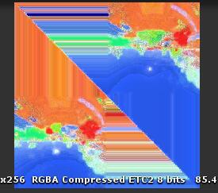

  采样函数如下：
	
	half3 GetIBLIrradiance(in half Roughness,in float3 R)
	{			
		half3 sampleEnvSpecular=half3(0,0,0);
		half MIP_ROUGHNESS=0.17;
		half level=Roughness / MIP_ROUGHNESS;
		half fSign= R.z > 0;
		half fSign2 = fSign * 2 - 1;
		R.xy /= (R.z * fSign2 + 1);
		R.xy = R.xy * half2(0.25,-0.25) + 0.25 + 0.5 * fSign;				
		half4 srcColor;								
		srcColor = tex2Dlod (_EnvMap, half4(R.xy, 0, level));
		sampleEnvSpecular= srcColor.rgb * (srcColor.a * srcColor.a * 16.0);	
		return sampleEnvSpecular;
	}			
	

###2. 角色光照分析

 * Directional light
 * Point light和Spot Light
 * 环境光(IBL)
 * 摄像机方向上的 Virtual Light
 * Dynamic GI

|Sun Diffuse|Sun Specular|Virtual Lit Diffuse|Virtual Lit Specular|
|-|-|-|-|
|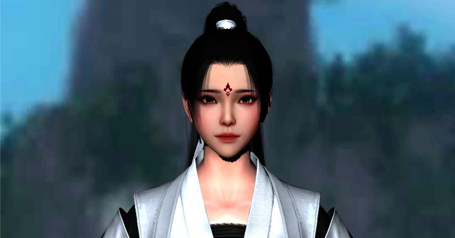|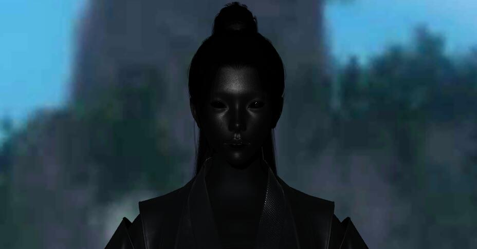|||

|GI Diffuse|Env Specular|Skin Refraction|Lighting|
|-|-|-|-|-|
|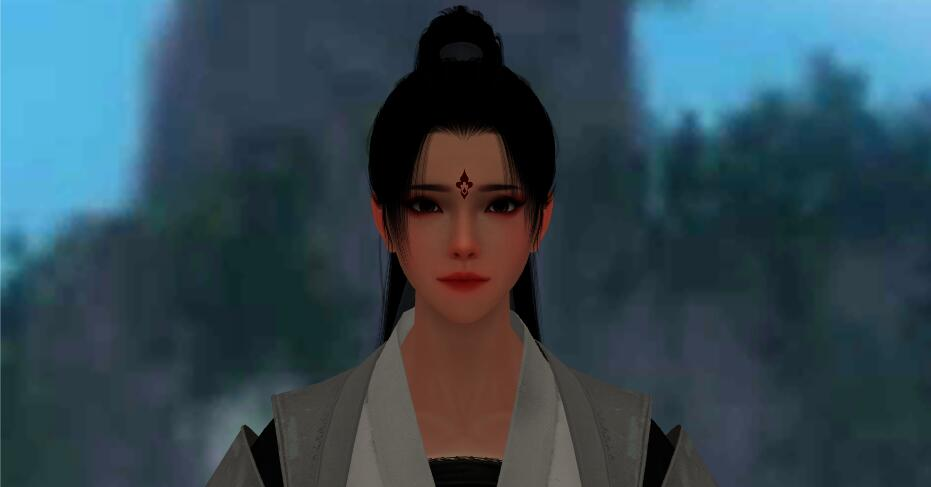||||

** Directional Light ** 

Directional Light 是游戏中主方向光，投射实时阴影。采用Lambert漫反射光照模型，GGX BRDF高光。

** Point Light ** 

游戏引擎支持点光源和聚光灯。游戏中在选择角色界面使用1个点光源。本次分析截帧的多个场景下未使用。

** 环境光反射 ** 

环境光反射与场景相同。

** Virtual Light ** 

Virtual Light 是游戏中从一个相机方向发出的只对角色作用的较弱的补光，也是平行光，不投射阴影。采用Lambert漫反射光照模型，GGX近似 BRDF高光模型。

** Dynamic GI **
游戏中使用预计算的实时GI，对角色影响。

** Other **

此外头发高光，皮肤，眼球等光照在下文中分别解读。

## 0x05 角色渲染

《一梦江湖》角色分为 身体，头部，头发，眼球（左右），角膜和泪腺，眉毛，睫毛等几个部分。其中身体，头部，眼球为不透明渲染；头发前后分别是镂空渲染和半透明渲染；眉毛和睫毛为半透明渲染，角膜和泪腺为半透明折射渲染。
其模型三角面数如下：

|Name|Body|Head|Eye|Corneal|Eyebrows|Eyelash|Hair mask|Hair Transparent|
|-|-|-|-|-|-|-|-|
|**Mesh**|||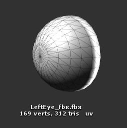|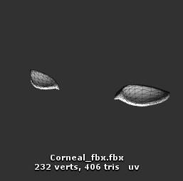||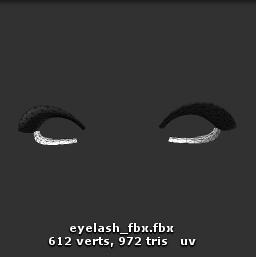 | 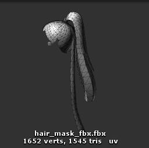| |
|**Triangles**|7066|5396|312|406|312|972|1545|5048|

### Body

《一梦江湖》角色身体皮肤和衣服并未分开，用Mask贴图区分开来，采用统一的光照。纹理大小为2048。

|Name|Base Color|Normal|Mask|Mix|
|-|-|-|-|-|
|Texture|||||
|Mobile Size|1024|512|512|1024|
|PC Size|2048|2048|512|2048|

* Normal 纹理A通道存储SSSmask.用于区分皮肤和其他部分
* BaseColor RGB为漫反射颜色，A通道为Mask
* Mix 纹理 R通道为Smoothness，G通道为 Metallic，B 通道为AO
* Mask 存储mask值区分布料和其他

### Head

角色头部渲染采用Pre-intergrated Skin Shading

|Name|Base Color|Normal|Detail Normal|Mix|Lut|Crystal|Crystal Mask|
|-|-|-|-|-|-|-|-|
|Texture||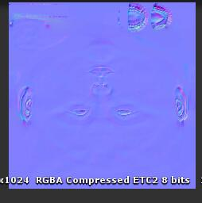|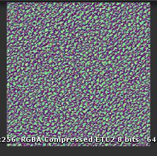||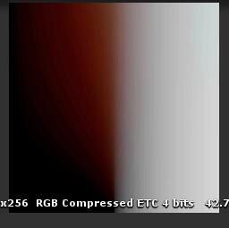|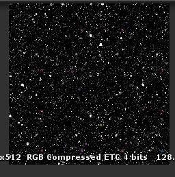||
|Size|1024|1024|256|1024|256|512|1024|
|Size|2048|2048|256|2048|256|512|2048|

* BaseColor RGB为漫反射颜色，A通道为Roughness
* Normal 纹理A通道存储毛孔细节Mask.
* Mix 纹理 R通道为透射度，G通道为SSS计算采样Lut图所需的曲率Curvature，B通道为AO
* Lut 皮肤预积分烘焙纹理，采样uv = half2(0.5 * NdotL + 0.5,Curvature)，Wrap Mode需设置成Clamp。
* Crystal 为妆容高光闪点纹理
* Crystal Mask 为妆容Mask,RGB通道分别控制眼部，脸颊，嘴唇。

### Eye

《一梦江湖》角色身体皮肤和衣服并未分开，用Mask贴图区分开来，采用统一的光照。纹理大小为2048。

|Name|Base Color|Normal|Mask|
|-|-|-|-|
|Texture|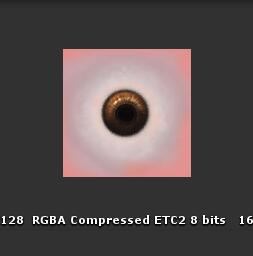|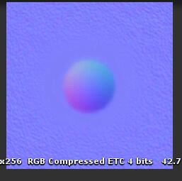||
|Mobile Size|128|256|256|
|PC Size|128|256|256|

* Normal 纹理A通道存储SSSmask.用于区分皮肤和其他部分
* BaseColor RGB为漫反射颜色，A通道为Mask
* Mix 纹理 R通道为Smoothness，G通道为 Metallic，B 通道为AO
* Mask 存储mask值区分布料和其他

### Corneal

《一梦江湖》角色身体皮肤和衣服并未分开，用Mask贴图区分开来，采用统一的光照。纹理大小为2048。

|Name|Base Color|Mix|
|-|-|-|-|
|Texture||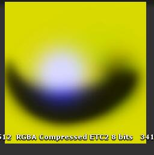|
|Mobile Size|512|512|
|PC Size|512|512|

* Normal 纹理A通道存储SSSmask.用于区分皮肤和其他部分
* BaseColor RGB为漫反射颜色，A通道为Mask
* Mix 纹理 R通道为Smoothness，G通道为 Metallic，B 通道为AO
* Mask 存储mask值区分布料和其他

### Hair

《一梦江湖》角色身体皮肤和衣服并未分开，用Mask贴图区分开来，采用统一的光照。纹理大小为2048。

|Name|Base Color|Normal|Mix|
|-|-|-|-|
|Texture|||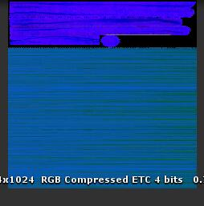|
|Mobile Size|1024|1024|1024|
|PC Size|1024|1024|1024|

* Normal 纹理A通道存储SSSmask.用于区分皮肤和其他部分
* BaseColor RGB为漫反射颜色，A通道为Mask
* Mix 纹理 R通道为Smoothness，G通道为 Metallic，B 通道为AO
* Mask 存储mask值区分布料和其他

### EyeLash & Eyebrow

《一梦江湖》角色身体皮肤和衣服并未分开，用Mask贴图区分开来，采用统一的光照。纹理大小为2048。

|Name|Eyelash|Eyebrow|
|-|-|-|-|
|Texture|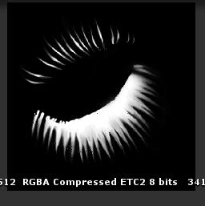|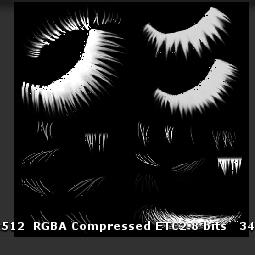|
|Mobile Size|512|512|
|PC Size|512|512|

* Normal 纹理A通道存储SSSmask.用于区分皮肤和其他部分
* BaseColor RGB为漫反射颜色，A通道为Mask
* Mix 纹理 R通道为Smoothness，G通道为 Metallic，B 通道为AO
* Mask 存储mask值区分布料和其他

